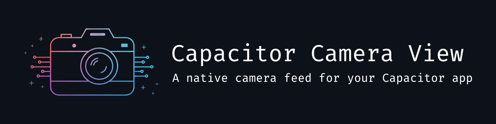

<p align="center">
  
</p>

<h1 align="center">Capacitor Camera View</h1>

<p align="center">
  <b>A Capacitor plugin for embedding a live camera feed directly into your app.</b>
</p>

<p align="center">
  <a href="https://www.npmjs.com/package/capacitor-camera-view">
    
  </a>
  <a href="https://github.com/michaelwolz/capacitor-camera-view/actions">
    
  </a>
  <a href="https://capacitorjs.com/">
    
  </a>
  <a href="https://opensource.org/license/apache-2-0">
    
  </a>
</p>

---

## 🚀 Features

- 📹 Embed a **live camera feed** directly into your app.
- 📸 Capture photos or frames from the camera preview.
- 🔍 **Barcode detection** support.
- 📱 **Virtual device support** for automatic lens selection based on zoom level and focus (iOS only).
- 🔦 Control **zoom**, **flash** and **torch** modes programmatically.
- ⚡ **High performance** with optimized native implementations.
- 🎯 **Simple to use** with a clean and intuitive API.
- 🌐 Works seamlessly on **iOS**, **Android**, and **Web**.

---

## 🪧 Demo


## 📦 Installation

Install the plugin using npm:

```bash
npm install capacitor-camera-view
npx cap sync
```

### Platform Configuration

#### iOS

Add the following keys to your app's `Info.plist` file:

```xml
<key>NSCameraUsageDescription</key>
<string>To capture photos and videos</string>
```

#### Android

The `CAMERA` permission is automatically added by Capacitor. Ensure your `AndroidManifest.xml` includes it if needed for specific configurations:

```xml
<uses-permission android:name="android.permission.CAMERA" />
```

## ▶️ Basic Usage

```typescript
import { CameraView } from 'capacitor-camera-view';

// Start the camera preview
const startCamera = async () => {
  try {
    await CameraView.start();
    console.log('Camera started');
    // Add the CSS class to make the WebView transparent
    document.body.classList.add('camera-running');
  } catch (e) {
    console.error('Error starting camera:', e);
  }
};

// Stop the camera preview
const stopCamera = async () => {
  try {
    document.body.classList.remove('camera-running');
    await CameraView.stop();
    console.log('Camera stopped');
  } catch (e) {
    console.error('Error stopping camera:', e);
  }
};

// Capture a photo
const capturePhoto = async () => {
  try {
    const result = await CameraView.capture();
    console.log('Photo captured:', result.photo); // Base64 encoded string
  } catch (e) {
    console.error('Error capturing photo:', e);
  }
};
```

### ⚠️ Make the WebView transparent when starting the camera view

To display the camera view through your app, you need to ensure that the WebView is made transparent. For Ionic applications, this can be done by adding the following styles to your global CSS file and applying the respective class to the body element as soon as you start the camera (see example app on how to do this in Angular):

```css
body.camera-running {
  visibility: hidden;
  --background: transparent;
  --ion-background-color: transparent;
}

.camera-modal {
  visibility: visible;
}
```

## 📸 Virtual Camera Support for iOS

On supported iPhone models (like the Pro series), this plugin can utilize the [**virtual triple camera**](https://developer.apple.com/documentation/avfoundation/avcapturedevice/devicetype-swift.struct/builtintriplecamera). This feature combines the ultra-wide, wide, and telephoto cameras into a single virtual device. iOS will then automatically switch between the physical cameras based on factors like zoom level and lighting conditions, providing seamless transitions and optimal image quality across a wider zoom range. You can enable this by setting the `useTripleCameraIfAvailable` option to `true` when calling `start()`.

**Pros:**
*   Smoother zooming experience across different focal lengths.
*   Automatic selection of the best lens for the current scene and zoom factor.

**Cons:**
*   Slightly higher resource usage compared to using a single physical camera (the camera view will take a little longer until initialized).
*   Only available on specific iPhone models with triple camera systems.

For more details on the underlying technology, refer to Apple's documentation on [AVCaptureDevice.builtInTripleCamera](https://developer.apple.com/documentation/avfoundation/avcapturedevice/devicetype-swift.struct/builtintriplecamera).

Alternatively, you can specify the `preferredCameraDeviceTypes` option in the <code><a href="#camerasessionconfiguration">CameraSessionConfiguration</a></code> to prioritize specific virtual cameras, such as the [dual camera system](https://developer.apple.com/documentation/avfoundation/avcapturedevice/devicetype-swift.struct/builtindualcamera). While this provides similar functionality, the `useTripleCameraIfAvailable` option offers the advantage of a smoother transition during camera initialization and lens switching (blurred overlay).

## 🔍 Barcode Detection

This plugin supports real-time barcode detection directly from the live camera feed.

**How it works:**
*   **iOS:** Utilizes the native [`AVCaptureMetadataOutput`](https://developer.apple.com/documentation/avfoundation/avcapturemetadataoutput).
*   **Android:** Utilizes Google's [**ML Kit Barcode Scanning**](https://developers.google.com/ml-kit/vision/barcode-scanning).
*   **Web:** Uses the [**Barcode Detection API**](https://developer.mozilla.org/en-US/docs/Web/API/Barcode_Detection_API) where available in the browser.

> [!NOTE]
> **Web Support:** The Barcode Detection API is not supported in all browsers (e.g., Windows browsers). For full browser compatibility, consider using a polyfill such as [`@undecaf/barcode-detector-polyfill`](https://www.npmjs.com/package/@undecaf/barcode-detector-polyfill) or [`barcode-detector`](https://www.npmjs.com/package/barcode-detector).

**Enabling Barcode Detection:**
To enable this feature, set the `enableBarcodeDetection` option to `true` when calling the `start()` method:

```typescript
await CameraView.start({ enableBarcodeDetection: true });
```

**Listening for Barcodes:**
Once enabled, you can listen for the `barcodeDetected` event to receive data about scanned barcodes:

```typescript
import { CameraView } from 'capacitor-camera-view';

CameraView.addListener('barcodeDetected', (data) => {
  console.log('Barcode detected:', data.value, data.type);
  // Handle the detected barcode data (e.g., display it, navigate)
});
```

See the [`BarcodeDetectionData`](#barcodedetectiondata) interface for details on the event payload.

## 🧪 Example App

To see the plugin in action, check out the example app in the `example-app` folder. The app demonstrates how to integrate and use the Capacitor Camera View plugin in an Ionic Angular project.

## Semantic Release

This project uses [semantic-release](https://github.com/semantic-release/semantic-release) for automated versioning and changelog generation based on conventional commits.

## Conventional Commits

Follow the [Conventional Commits](https://www.conventionalcommits.org/) specification for your commit messages. Example:

```
feat(camera): add autofocus support
fix(android): resolve crash on startup
chore: update dependencies
```

## Resources
- [semantic-release documentation](https://semantic-release.gitbook.io/semantic-release/)
- [Conventional Commits](https://www.conventionalcommits.org/)


## API

<docgen-index>

* [`start(...)`](#start)
* [`stop()`](#stop)
* [`isRunning()`](#isrunning)
* [`capture(...)`](#capture)
* [`captureSample(...)`](#capturesample)
* [`flipCamera()`](#flipcamera)
* [`getAvailableDevices()`](#getavailabledevices)
* [`getZoom()`](#getzoom)
* [`setZoom(...)`](#setzoom)
* [`getFlashMode()`](#getflashmode)
* [`getSupportedFlashModes()`](#getsupportedflashmodes)
* [`setFlashMode(...)`](#setflashmode)
* [`isTorchAvailable()`](#istorchavailable)
* [`getTorchMode()`](#gettorchmode)
* [`setTorchMode(...)`](#settorchmode)
* [`checkPermissions()`](#checkpermissions)
* [`requestPermissions()`](#requestpermissions)
* [`addListener('barcodeDetected', ...)`](#addlistenerbarcodedetected-)
* [`removeAllListeners(...)`](#removealllisteners)
* [Interfaces](#interfaces)
* [Type Aliases](#type-aliases)

</docgen-index>

<docgen-api>
<!--Update the source file JSDoc comments and rerun docgen to update the docs below-->

Main plugin interface for Capacitor Camera View functionality.

### start(...)

```typescript
start(options?: CameraSessionConfiguration | undefined) => Promise<void>
```

Start the camera view with optional configuration.

| Param         | Type                                                                              | Description                                    |
| ------------- | --------------------------------------------------------------------------------- | ---------------------------------------------- |
| **`options`** | <code><a href="#camerasessionconfiguration">CameraSessionConfiguration</a></code> | - Configuration options for the camera session |

**Since:** 1.0.0

--------------------


### stop()

```typescript
stop() => Promise<void>
```

Stop the camera view and release resources.

**Since:** 1.0.0

--------------------


### isRunning()

```typescript
isRunning() => Promise<IsRunningResponse>
```

Check if the camera view is currently running.

**Returns:** <code>Promise&lt;<a href="#isrunningresponse">IsRunningResponse</a>&gt;</code>

**Since:** 1.0.0

--------------------


### capture(...)

```typescript
capture<T extends CaptureOptions>(options: T) => Promise<CaptureResponse<T>>
```

Capture a photo using the current camera configuration.

| Param         | Type           | Description                     |
| ------------- | -------------- | ------------------------------- |
| **`options`** | <code>T</code> | - Capture configuration options |

**Returns:** <code>Promise&lt;<a href="#captureresponse">CaptureResponse</a>&lt;T&gt;&gt;</code>

**Since:** 1.0.0

--------------------


### captureSample(...)

```typescript
captureSample<T extends CaptureOptions>(options: T) => Promise<CaptureResponse<T>>
```

Captures a frame from the current camera preview without using the full camera capture pipeline.

Unlike `capture()` which may trigger hardware-level photo capture on native platforms,
this method quickly samples the current video stream. This is suitable computer vision or
simple snapshots where high fidelity is not required.

On web this method does exactly the same as `capture()` as it only captures a frame from the video stream
because unfortunately [ImageCapture API](https://developer.mozilla.org/en-US/docs/Web/API/ImageCapture) is
not yet well supported on the web.

| Param         | Type           | Description                     |
| ------------- | -------------- | ------------------------------- |
| **`options`** | <code>T</code> | - Capture configuration options |

**Returns:** <code>Promise&lt;<a href="#captureresponse">CaptureResponse</a>&lt;T&gt;&gt;</code>

**Since:** 1.0.0

--------------------


### flipCamera()

```typescript
flipCamera() => Promise<void>
```

Switch between front and back camera.

**Since:** 1.0.0

--------------------


### getAvailableDevices()

```typescript
getAvailableDevices() => Promise<GetAvailableDevicesResponse>
```

Get available camera devices for capturing photos.

**Returns:** <code>Promise&lt;<a href="#getavailabledevicesresponse">GetAvailableDevicesResponse</a>&gt;</code>

**Since:** 1.0.0

--------------------


### getZoom()

```typescript
getZoom() => Promise<GetZoomResponse>
```

Get current zoom level information and available range.

**Returns:** <code>Promise&lt;<a href="#getzoomresponse">GetZoomResponse</a>&gt;</code>

**Since:** 1.0.0

--------------------


### setZoom(...)

```typescript
setZoom(options: { level: number; ramp?: boolean; }) => Promise<void>
```

Set the camera zoom level.

| Param         | Type                                            | Description                  |
| ------------- | ----------------------------------------------- | ---------------------------- |
| **`options`** | <code>{ level: number; ramp?: boolean; }</code> | - Zoom configuration options |

**Since:** 1.0.0

--------------------


### getFlashMode()

```typescript
getFlashMode() => Promise<GetFlashModeResponse>
```

Get current flash mode setting.

**Returns:** <code>Promise&lt;<a href="#getflashmoderesponse">GetFlashModeResponse</a>&gt;</code>

**Since:** 1.0.0

--------------------


### getSupportedFlashModes()

```typescript
getSupportedFlashModes() => Promise<GetSupportedFlashModesResponse>
```

Get supported flash modes for the current camera.

**Returns:** <code>Promise&lt;<a href="#getsupportedflashmodesresponse">GetSupportedFlashModesResponse</a>&gt;</code>

**Since:** 1.0.0

--------------------


### setFlashMode(...)

```typescript
setFlashMode(options: { mode: FlashMode; }) => Promise<void>
```

Set the camera flash mode.

| Param         | Type                                                       | Description                        |
| ------------- | ---------------------------------------------------------- | ---------------------------------- |
| **`options`** | <code>{ mode: <a href="#flashmode">FlashMode</a>; }</code> | - Flash mode configuration options |

**Since:** 1.0.0

--------------------


### isTorchAvailable()

```typescript
isTorchAvailable() => Promise<IsTorchAvailableResponse>
```

Check if the device supports torch (flashlight) functionality.

**Returns:** <code>Promise&lt;<a href="#istorchavailableresponse">IsTorchAvailableResponse</a>&gt;</code>

**Since:** 1.2.0

--------------------


### getTorchMode()

```typescript
getTorchMode() => Promise<GetTorchModeResponse>
```

Get the current torch (flashlight) state.

**Returns:** <code>Promise&lt;<a href="#gettorchmoderesponse">GetTorchModeResponse</a>&gt;</code>

**Since:** 1.2.0

--------------------


### setTorchMode(...)

```typescript
setTorchMode(options: { enabled: boolean; level?: number; }) => Promise<void>
```

Set the torch (flashlight) mode and intensity.

| Param         | Type                                               | Description                   |
| ------------- | -------------------------------------------------- | ----------------------------- |
| **`options`** | <code>{ enabled: boolean; level?: number; }</code> | - Torch configuration options |

**Since:** 1.2.0

--------------------


### checkPermissions()

```typescript
checkPermissions() => Promise<PermissionStatus>
```

Check camera permission status without requesting permissions.

**Returns:** <code>Promise&lt;<a href="#permissionstatus">PermissionStatus</a>&gt;</code>

**Since:** 1.0.0

--------------------


### requestPermissions()

```typescript
requestPermissions() => Promise<PermissionStatus>
```

Request camera permission from the user.

**Returns:** <code>Promise&lt;<a href="#permissionstatus">PermissionStatus</a>&gt;</code>

**Since:** 1.0.0

--------------------


### addListener('barcodeDetected', ...)

```typescript
addListener(eventName: 'barcodeDetected', listenerFunc: (data: BarcodeDetectionData) => void) => Promise<PluginListenerHandle>
```

Listen for barcode detection events.
This event is emitted when a barcode is detected in the camera preview.

| Param              | Type                                                                                     | Description                                                   |
| ------------------ | ---------------------------------------------------------------------------------------- | ------------------------------------------------------------- |
| **`eventName`**    | <code>'barcodeDetected'</code>                                                           | - The name of the event to listen for ('barcodeDetected')     |
| **`listenerFunc`** | <code>(data: <a href="#barcodedetectiondata">BarcodeDetectionData</a>) =&gt; void</code> | - The callback function to execute when a barcode is detected |

**Returns:** <code>Promise&lt;<a href="#pluginlistenerhandle">PluginListenerHandle</a>&gt;</code>

**Since:** 1.0.0

--------------------


### removeAllListeners(...)

```typescript
removeAllListeners(eventName?: string | undefined) => Promise<void>
```

Remove all listeners for this plugin.

| Param           | Type                | Description                                   |
| --------------- | ------------------- | --------------------------------------------- |
| **`eventName`** | <code>string</code> | - Optional event name to remove listeners for |

**Since:** 1.0.0

--------------------


### Interfaces


#### CameraSessionConfiguration

Configuration options for starting a camera session.

| Prop                             | Type                                                      | Description                                                                                                                                                                                                                                                                                                                                                              | Default                                                                | Since |
| -------------------------------- | --------------------------------------------------------- | ------------------------------------------------------------------------------------------------------------------------------------------------------------------------------------------------------------------------------------------------------------------------------------------------------------------------------------------------------------------------ | ---------------------------------------------------------------------- | ----- |
| **`enableBarcodeDetection`**     | <code>boolean</code>                                      | Enables the barcode detection functionality                                                                                                                                                                                                                                                                                                                              | <code>false</code>                                                     |       |
| **`barcodeTypes`**               | <code>BarcodeType[]</code>                                | Specific barcode types to detect. If not provided, all supported types are detected. Specifying only the types you need can significantly improve performance and reduce battery consumption, especially on mobile devices.                                                                                                                                              | <code>undefined - all supported types are detected</code>              | 2.1.0 |
| **`position`**                   | <code><a href="#cameraposition">CameraPosition</a></code> | Position of the camera to use                                                                                                                                                                                                                                                                                                                                            | <code>'back'</code>                                                    |       |
| **`deviceId`**                   | <code>string</code>                                       | Specific device ID of the camera to use If provided, takes precedence over position                                                                                                                                                                                                                                                                                      |                                                                        |       |
| **`useTripleCameraIfAvailable`** | <code>boolean</code>                                      | Whether to use the triple camera if available (iPhone Pro models only)                                                                                                                                                                                                                                                                                                   | <code>false</code>                                                     |       |
| **`preferredCameraDeviceTypes`** | <code>CameraDeviceType[]</code>                           | Ordered list of preferred camera device types to use (iOS only). The system will attempt to use the first available camera type in the list. If position is also provided, the system will use the first available camera type that matches the position and is in the list. This will fallback to the default camera type if none of the preferred types are available. | <code>undefined - system will decide based on position/deviceId</code> |       |
| **`zoomFactor`**                 | <code>number</code>                                       | The initial zoom factor to use                                                                                                                                                                                                                                                                                                                                           | <code>1.0</code>                                                       |       |
| **`containerElementId`**         | <code>string</code>                                       | Optional HTML ID of the container element where the camera view should be rendered. If not provided, the camera view will be appended to the document body. Web only.                                                                                                                                                                                                    |                                                                        |       |


#### IsRunningResponse

Response for checking if the camera view is running.

| Prop            | Type                 | Description                                                  |
| --------------- | -------------------- | ------------------------------------------------------------ |
| **`isRunning`** | <code>boolean</code> | Indicates if the camera view is currently active and running |


#### CaptureOptions

Configuration options for capturing photos and samples.

| Prop             | Type                 | Description                                                                                                                                                                                                                                                                                                                | Default            | Since |
| ---------------- | -------------------- | -------------------------------------------------------------------------------------------------------------------------------------------------------------------------------------------------------------------------------------------------------------------------------------------------------------------------- | ------------------ | ----- |
| **`quality`**    | <code>number</code>  | The JPEG quality of the captured photo/sample on a scale of 0-100                                                                                                                                                                                                                                                          |                    | 1.1.0 |
| **`saveToFile`** | <code>boolean</code> | If true, saves to a temporary file and returns the web path instead of base64. The web path can be used to set the src attribute of an image for efficient loading and rendering. This reduces the data that needs to be transferred over the bridge, which can improve performance especially for high-resolution images. | <code>false</code> | 1.1.0 |


#### GetAvailableDevicesResponse

Response for getting available camera devices.

| Prop          | Type                        | Description                          |
| ------------- | --------------------------- | ------------------------------------ |
| **`devices`** | <code>CameraDevice[]</code> | An array of available camera devices |


#### CameraDevice

Represents a physical camera device on the device.

| Prop             | Type                                                          | Description                                                                  |
| ---------------- | ------------------------------------------------------------- | ---------------------------------------------------------------------------- |
| **`id`**         | <code>string</code>                                           | The unique identifier of the camera device                                   |
| **`name`**       | <code>string</code>                                           | The human-readable name of the camera device                                 |
| **`position`**   | <code><a href="#cameraposition">CameraPosition</a></code>     | The position of the camera device (front or back)                            |
| **`deviceType`** | <code><a href="#cameradevicetype">CameraDeviceType</a></code> | The type of the camera device (e.g., wide, ultra-wide, telephoto) - iOS only |


#### GetZoomResponse

Response for getting zoom level information.

| Prop          | Type                | Description                      |
| ------------- | ------------------- | -------------------------------- |
| **`min`**     | <code>number</code> | The minimum zoom level supported |
| **`max`**     | <code>number</code> | The maximum zoom level supported |
| **`current`** | <code>number</code> | The current zoom level           |


#### GetFlashModeResponse

Response for getting the current flash mode.

| Prop            | Type                                            | Description                    |
| --------------- | ----------------------------------------------- | ------------------------------ |
| **`flashMode`** | <code><a href="#flashmode">FlashMode</a></code> | The current flash mode setting |


#### GetSupportedFlashModesResponse

Response for getting supported flash modes.

| Prop             | Type                     | Description                                             |
| ---------------- | ------------------------ | ------------------------------------------------------- |
| **`flashModes`** | <code>FlashMode[]</code> | An array of flash modes supported by the current camera |


#### IsTorchAvailableResponse

Response for checking torch availability.

| Prop            | Type                 | Description                                                       |
| --------------- | -------------------- | ----------------------------------------------------------------- |
| **`available`** | <code>boolean</code> | Indicates if the device supports torch (flashlight) functionality |


#### GetTorchModeResponse

Response for getting the current torch mode.

| Prop          | Type                 | Description                                                                                  |
| ------------- | -------------------- | -------------------------------------------------------------------------------------------- |
| **`enabled`** | <code>boolean</code> | Indicates if the torch is currently enabled                                                  |
| **`level`**   | <code>number</code>  | The current torch intensity level (0.0 to 1.0, iOS only). Always 1.0 on Android when enabled |


#### PermissionStatus

Response for the camera permission status.

| Prop         | Type                                                        | Description                        |
| ------------ | ----------------------------------------------------------- | ---------------------------------- |
| **`camera`** | <code><a href="#permissionstate">PermissionState</a></code> | The state of the camera permission |


#### PluginListenerHandle

| Prop         | Type                                      |
| ------------ | ----------------------------------------- |
| **`remove`** | <code>() =&gt; Promise&lt;void&gt;</code> |


#### BarcodeDetectionData

Data for a detected barcode.

| Prop               | Type                                                  | Description                                                      |
| ------------------ | ----------------------------------------------------- | ---------------------------------------------------------------- |
| **`value`**        | <code>string</code>                                   | The decoded string value of the barcode                          |
| **`displayValue`** | <code>string</code>                                   | The display value of the barcode (may differ from the raw value) |
| **`type`**         | <code>string</code>                                   | The type/format of the barcode (e.g., 'qr', 'code128', etc.)     |
| **`boundingRect`** | <code><a href="#boundingrect">BoundingRect</a></code> | The bounding rectangle of the barcode in the camera frame.       |


#### BoundingRect

Rectangle defining the boundary of the barcode in the camera frame.
Coordinates are normalized between 0 and 1 relative to the camera frame.

| Prop         | Type                | Description                                                                      |
| ------------ | ------------------- | -------------------------------------------------------------------------------- |
| **`x`**      | <code>number</code> | X-coordinate of the top-left corner                                              |
| **`y`**      | <code>number</code> | Y-coordinate of the top-left corner                                              |
| **`width`**  | <code>number</code> | Width of the bounding rectangle (should match the actual width of the barcode)   |
| **`height`** | <code>number</code> | Height of the bounding rectangle (should match the actual height of the barcode) |


### Type Aliases


#### BarcodeType

Supported barcode types for detection.
Specifying only the barcode types you need can improve performance
and reduce battery consumption.

<code>'qr' | 'code128' | 'code39' | 'code39Mod43' | 'code93' | 'ean8' | 'ean13' | 'interleaved2of5' | 'itf14' | 'pdf417' | 'aztec' | 'dataMatrix' | 'upce'</code>


#### CameraPosition

Position options for the camera.
- 'front': Front-facing camera
- 'back': Rear-facing camera

<code>'front' | 'back'</code>


#### CameraDeviceType

Available camera device types for iOS.
Maps to AVCaptureDevice DeviceTypes in iOS.

<code>'wideAngle' | 'ultraWide' | 'telephoto' | 'dual' | 'dualWide' | 'triple' | 'trueDepth'</code>


#### CaptureResponse

Response for capturing a photo
This will contain either a base64 encoded string or a web path to the captured photo,
depending on the `saveToFile` option in the <a href="#captureoptions">CaptureOptions</a>.

<code>T['saveToFile'] extends true ? { /** The web path to the captured photo that can be used to set the src attribute of an image for efficient loading and rendering (when saveToFile is true) */ webPath: string; } : { /** The base64 encoded string of the captured photo (when saveToFile is false or undefined) */ photo: string; }</code>


#### FlashMode

Flash mode options for the camera.
- 'off': Flash disabled
- 'on': Flash always on
- 'auto': Flash automatically enabled in low-light conditions

<code>'off' | 'on' | 'auto'</code>


#### PermissionState

<code>'prompt' | 'prompt-with-rationale' | 'granted' | 'denied'</code>

</docgen-api>
