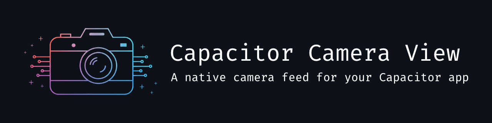

<p align="center">
  
</p>

<h1 align="center">Capacitor Camera View</h1>

<p align="center">
  <b>A Capacitor plugin for embedding a live camera feed directly into your app.</b>
</p>

<p align="center">
  <a href="https://www.npmjs.com/package/capacitor-camera-view">
    
  </a>
  <a href="https://github.com/michaelwolz/capacitor-camera-view/actions">
    
  </a>
  <a href="https://capacitorjs.com/">
    
  </a>
  <a href="https://opensource.org/license/apache-2-0">
    
  </a>
</p>

---

## 🚀 Features

- 📹 Embed a **live camera feed** directly into your app.
- 📸 Capture photos or frames from the camera preview.
- 🎥 **Video recording** with optional audio support.
- 🔍 **Barcode detection** support.
- 📱 **Virtual device support** for automatic lens selection based on zoom level and focus (iOS only).
- 🔦 Control **zoom**, **flash** and **torch** modes programmatically.
- ⚡ **High performance** with optimized native implementations.
- 🎯 **Simple to use** with a clean and intuitive API.
- 🌐 Works seamlessly on **iOS**, **Android**, and **Web**.

---

## 🪧 Demo


## 📦 Installation

Install the plugin using npm:

```bash
npm install capacitor-camera-view
npx cap sync
```

### Platform Configuration

#### iOS

> [!IMPORTANT]
> This plugin requires a minimum deployment target of **iOS 16**. iOS 15 is no longer supported.

Add the following keys to your app's `Info.plist` file:

```xml
<key>NSCameraUsageDescription</key>
<string>To capture photos and videos</string>
```

If you plan to use `startRecording` with `enableAudio: true`, also add:

```xml
<key>NSMicrophoneUsageDescription</key>
<string>To record audio with video</string>
```

> [!IMPORTANT]
> The `NSMicrophoneUsageDescription` key must be present in `Info.plist` **before** microphone permission is ever requested — even if the request happens automatically when starting a recording with audio. Omitting it will cause your app to crash at runtime.

#### Android

You must declare the `CAMERA` permission yourself in your app's `AndroidManifest.xml`:

```xml
<uses-permission android:name="android.permission.CAMERA" />
```

If you plan to use `startRecording` with `enableAudio: true`, you must also declare the `RECORD_AUDIO` permission in your app's `AndroidManifest.xml`:

```xml
<uses-permission android:name="android.permission.RECORD_AUDIO" />
```

> [!IMPORTANT]
> Declaring a permission in `AndroidManifest.xml` is required for the system to allow requesting it at runtime. The plugin does not declare `CAMERA` or `RECORD_AUDIO` for you, so make sure you add `CAMERA` for camera use, and `RECORD_AUDIO` as well if you record video with audio.

> [!WARNING]
> **Breaking change (Android):** as of this release, the plugin no longer declares `android.permission.RECORD_AUDIO` in its manifest. Apps that call `startRecording` with `enableAudio: true` **must** add `<uses-permission android:name="android.permission.RECORD_AUDIO" />` to their own `AndroidManifest.xml`, otherwise audio recording will fail at runtime. Apps that only record video without audio (or don't record at all) are unaffected and no longer need to carry this permission.

## 🔒 Permissions

The plugin handles permissions for you automatically when a feature that requires them is used. However, you can also request permissions explicitly in advance.

### Requesting permissions explicitly

By default, `requestPermissions()` only requests **camera** permission, preserving backward compatibility:

```typescript
// Request camera permission only (default behavior)
const status = await CameraView.requestPermissions();
console.log(status.camera); // 'granted' | 'denied' | 'prompt'
```

To also request **microphone** permission (needed for video recording with audio), pass the `permissions` option:

```typescript
// Request both camera and microphone permissions
const status = await CameraView.requestPermissions({
  permissions: ['camera', 'microphone'],
});
console.log(status.camera);     // 'granted' | 'denied' | 'prompt'
console.log(status.microphone); // 'granted' | 'denied' | 'prompt'
```

### Automatic permission requests

You do not need to call `requestPermissions()` manually. The plugin will automatically request the required permissions when a feature is first used:

- **Camera** permission is requested automatically when `start()` is called.
- **Microphone** permission is requested automatically when `startRecording({ enableAudio: true })` is called.

Regardless of whether you request permissions manually or rely on the automatic flow, the corresponding entries **must** be declared in your app's platform configuration (`Info.plist` on iOS, `AndroidManifest.xml` on Android) as described above.

### Checking permission status

Use `checkPermissions()` to query the current permission state without triggering a system prompt:

```typescript
const status = await CameraView.checkPermissions();
console.log(status.camera);     // 'granted' | 'denied' | 'prompt'
console.log(status.microphone); // 'granted' | 'denied' | 'prompt'
```

## ▶️ Basic Usage

```typescript
import { CameraView } from 'capacitor-camera-view';

// Start the camera preview
const startCamera = async () => {
  try {
    await CameraView.start();
    console.log('Camera started');
    // Add the CSS class to make the WebView transparent
    document.body.classList.add('camera-running');
  } catch (e) {
    console.error('Error starting camera:', e);
  }
};

// Stop the camera preview
const stopCamera = async () => {
  try {
    document.body.classList.remove('camera-running');
    await CameraView.stop();
    console.log('Camera stopped');
  } catch (e) {
    console.error('Error stopping camera:', e);
  }
};

// Capture a photo
const capturePhoto = async () => {
  try {
    const result = await CameraView.capture();
    console.log('Photo captured:', result.photo); // Base64 encoded string
  } catch (e) {
    console.error('Error capturing photo:', e);
  }
};
```

### ⚠️ Make the WebView transparent when starting the camera view

To display the camera view through your app, you need to ensure that the WebView is made transparent. For Ionic applications, this can be done by adding the following styles to your global CSS file and applying the respective class to the body element as soon as you start the camera (see example app on how to do this in Angular):

```css
body.camera-running {
  visibility: hidden;
  --background: transparent;
  --ion-background-color: transparent;
}

.camera-modal {
  visibility: visible;
}
```

## 📸 Virtual Camera Support for iOS

On supported iPhone models (like the Pro series), this plugin can utilize the [**virtual triple camera**](https://developer.apple.com/documentation/avfoundation/avcapturedevice/devicetype-swift.struct/builtintriplecamera). This feature combines the ultra-wide, wide, and telephoto cameras into a single virtual device. iOS will then automatically switch between the physical cameras based on factors like zoom level and lighting conditions, providing seamless transitions and optimal image quality across a wider zoom range. You can enable this by setting the `useTripleCameraIfAvailable` option to `true` when calling `start()`.

**Pros:**
*   Smoother zooming experience across different focal lengths.
*   Automatic selection of the best lens for the current scene and zoom factor.

**Cons:**
*   Slightly higher resource usage compared to using a single physical camera (the camera view will take a little longer until initialized).
*   Only available on specific iPhone models with triple camera systems.

The session starts on the virtual device directly, so there is no visible transition — the first frame the user sees is already the wide-angle ("1x") field of view. Note that `zoomFactor` is interpreted relative to the wide-angle lens while `getZoom()` reports the device's raw zoom domain, in which `1.0` is the ultra-wide lens.

On iOS 26 and later the plugin additionally uses [Deferred Start](https://developer.apple.com/documentation/avfoundation/avcaptureoutput/deferredstartenabled) so only the preview pipeline is initialized before the first frame is displayed; photo capture, snapshots and barcode detection are brought up a moment later. This roughly halves the time until the preview appears and is what makes starting on the virtual device affordable.

For more details on the underlying technology, refer to Apple's documentation on [AVCaptureDevice.builtInTripleCamera](https://developer.apple.com/documentation/avfoundation/avcapturedevice/devicetype-swift.struct/builtintriplecamera).

Alternatively, you can specify the `preferredCameraDeviceTypes` option in the <code><a href="#camerasessionconfiguration">CameraSessionConfiguration</a></code> to prioritize specific virtual cameras, such as the [dual camera system](https://developer.apple.com/documentation/avfoundation/avcapturedevice/devicetype-swift.struct/builtindualcamera). `useTripleCameraIfAvailable` takes precedence over `preferredCameraDeviceTypes` for the rear camera.

## 🔍 Barcode Detection

This plugin supports real-time barcode detection directly from the live camera feed.

**How it works:**
*   **iOS:** Utilizes the native [`AVCaptureMetadataOutput`](https://developer.apple.com/documentation/avfoundation/avcapturemetadataoutput).
*   **Android:** Utilizes Google's [**ML Kit Barcode Scanning**](https://developers.google.com/ml-kit/vision/barcode-scanning).
*   **Web:** Uses the [**Barcode Detection API**](https://developer.mozilla.org/en-US/docs/Web/API/Barcode_Detection_API) where available in the browser.

> [!NOTE]
> **Web Support:** The Barcode Detection API is not supported in all browsers (e.g., Windows browsers). For full browser compatibility, consider using a polyfill such as [`@undecaf/barcode-detector-polyfill`](https://www.npmjs.com/package/@undecaf/barcode-detector-polyfill) or [`barcode-detector`](https://www.npmjs.com/package/barcode-detector).

**Enabling Barcode Detection:**
To enable this feature, set the `enableBarcodeDetection` option to `true` when calling the `start()` method:

```typescript
await CameraView.start({ enableBarcodeDetection: true });
```

**Listening for Barcodes:**
Once enabled, you can listen for the `barcodeDetected` event to receive data about scanned barcodes:

```typescript
import { CameraView } from 'capacitor-camera-view';

CameraView.addListener('barcodeDetected', (data) => {
  console.log('Barcode detected:', data.value, data.type);
  // Handle the detected barcode data (e.g., display it, navigate)
});
```

See the [`BarcodeDetectionData`](#barcodedetectiondata) interface for details on the event payload.

## 🎥 Video Recording

This plugin supports recording video directly from the live camera feed.

**How it works:**
*   **iOS:** Uses `AVCaptureMovieFileOutput` on top of the existing `AVCaptureSession`. Output is saved as `.mp4`.
*   **Android:** Uses the CameraX `VideoCapture` use case bound through `ProcessCameraProvider`. Output is saved as `.mp4`.
*   **Web:** Uses the browser `MediaRecorder` API on the existing `MediaStream`. Output is a `.webm` blob URL (MP4 is not broadly supported by browsers).

**Basic usage:**

```typescript
import { CameraView } from 'capacitor-camera-view';

// Start recording (camera must already be running)
await CameraView.startRecording({ enableAudio: false });

// Stop recording and get the result
const result = await CameraView.stopRecording();
console.log('Video saved to:', result.webPath);
```

**Playing back the recorded video:**

```html
<video [src]="videoPath" controls></video>
```

**Recording with audio:**

```typescript
await CameraView.startRecording({ enableAudio: true });
```

**Recording with explicit quality preset (native):**

```typescript
await CameraView.startRecording({
  enableAudio: true,
  videoQuality: 'fhd', // lowest | sd | hd | fhd | uhd | highest
});
```

> [!NOTE]
> When `enableAudio: true` is used, the plugin automatically requests microphone permission from the user if it has not been granted yet. The permission declaration must still be present in your platform configuration — see the [Permissions](#-permissions) section for details.

See the [`VideoRecordingOptions`](#videorecordingoptions) and [`VideoRecordingResponse`](#videorecordingresponse) interfaces in the API section for the full set of options.

## ⚠️ Error Handling

Every rejected plugin call carries a stable, platform-independent `code` string in addition to the human-readable `message`, so you can `switch` on `error.code` instead of matching on message text (which may change between releases or be localized).

```typescript
import { CameraView, type CameraErrorCode } from 'capacitor-camera-view';

try {
  await CameraView.start();
} catch (error) {
  const code = (error as { code?: CameraErrorCode }).code;

  switch (code) {
    case 'PERMISSION_DENIED':
      // Prompt the user to grant camera access in system settings
      break;
    case 'SESSION_NOT_RUNNING':
      // The capture session isn't up yet; call start() again
      break;
    default:
      console.error('Failed to start camera', error);
  }
}
```

> [!NOTE]
> Emitted on iOS, Android, and web. One divergence: on web, methods with no web
> implementation (e.g. `setFocusPoint()`, `setTorchMode()`) reject with
> `error.code === 'UNIMPLEMENTED'` - Capacitor's own not-implemented convention -
> instead of one of the codes below.

| Code                            | Meaning                                                                          |
| -------------------------------- | --------------------------------------------------------------------------------- |
| `CAMERA_UNAVAILABLE`             | No available camera for the requested position.                                 |
| `CONFIGURATION_FAILED`           | Failed to configure the camera session.                                         |
| `FRAME_CAPTURE_ERROR`            | Failed to capture a frame from the camera.                                      |
| `INPUT_ADDITION_FAILED`          | Failed to add an input to the capture session.                                  |
| `OUTPUT_ADDITION_FAILED`         | Failed to add an output to the capture session.                                 |
| `PHOTO_OUTPUT_ERROR`             | An error occurred while capturing a photo.                                      |
| `PHOTO_OUTPUT_NOT_CONFIGURED`    | The photo output has not been configured.                                       |
| `SESSION_NOT_RUNNING`            | The capture session is not currently running. Call `start()` first.             |
| `SESSION_ALREADY_RUNNING`        | A camera session is already running. Call `stop()` before starting a new one.   |
| `UNSUPPORTED_FLASH_MODE`         | The requested flash mode is not supported by the current camera.                |
| `TORCH_UNAVAILABLE`              | Torch is not available on this device or camera position.                       |
| `ZOOM_FACTOR_OUT_OF_RANGE`       | The requested zoom factor is out of the supported range.                        |
| `FOCUS_NOT_SUPPORTED`            | The current camera cannot focus or meter at a point (e.g. a fixed-focus camera). |
| `PERMISSION_DENIED`              | Camera or microphone access has been denied.                                    |
| `DEVICE_LOCKED`                  | The camera device is currently locked by another process.                       |
| `RECORDING_ALREADY_IN_PROGRESS`  | A video recording is already in progress.                                       |
| `NO_RECORDING_IN_PROGRESS`       | `stopRecording()` was called but no recording is in progress.                   |
| `AUDIO_DEVICE_UNAVAILABLE`       | No microphone is available on this device.                                      |
| `AUDIO_INPUT_ADDITION_FAILED`    | Failed to add the microphone input to the capture session.                      |
| `CAPTURE_IN_PROGRESS`            | A capture is already in progress.                                               |
| `CAPTURE_TIMEOUT`                | Timed out waiting for a camera frame.                                           |
| `WEBVIEW_UNAVAILABLE`            | Could not find the web view to render the camera preview into.                  |
| `INVALID_ARGUMENT`               | An argument passed to the method call was missing or invalid.                   |
| `IMAGE_COMPRESSION_FAILED`       | Failed to compress the captured image.                                          |
| `PATH_CONVERSION_FAILED`         | Failed to create a web-accessible path for a captured file.                     |
| `FILE_WRITE_FAILED`              | Failed to write the captured file to disk.                                      |
| `CAPTURE_OUTPUT_MISSING`         | The capture completed but produced no output data.                              |
| `LIFECYCLE_OWNER_MISSING`        | (Android only) The WebView's context is not a `LifecycleOwner`, so the camera session cannot be bound. |
| `UNKNOWN_ERROR`                  | An unexpected error that does not map to a known camera error.                  |

## 🧪 Example App

To see the plugin in action, check out the example app in the `example-app` folder. The app demonstrates how to integrate and use the Capacitor Camera View plugin in an Ionic Angular project.

## Semantic Release

This project uses [semantic-release](https://github.com/semantic-release/semantic-release) for automated versioning and changelog generation based on conventional commits.

## Conventional Commits

Follow the [Conventional Commits](https://www.conventionalcommits.org/) specification for your commit messages. Example:

```
feat(camera): add autofocus support
fix(android): resolve crash on startup
chore: update dependencies
```

## Resources
- [semantic-release documentation](https://semantic-release.gitbook.io/semantic-release/)
- [Conventional Commits](https://www.conventionalcommits.org/)


## API

<docgen-index>

* [`start(...)`](#start)
* [`stop()`](#stop)
* [`isRunning()`](#isrunning)
* [`capture(...)`](#capture)
* [`captureSample(...)`](#capturesample)
* [`startRecording(...)`](#startrecording)
* [`stopRecording()`](#stoprecording)
* [`flipCamera()`](#flipcamera)
* [`getAvailableDevices()`](#getavailabledevices)
* [`getZoom()`](#getzoom)
* [`setZoom(...)`](#setzoom)
* [`setFocusPoint(...)`](#setfocuspoint)
* [`getFlashMode()`](#getflashmode)
* [`getSupportedFlashModes()`](#getsupportedflashmodes)
* [`setFlashMode(...)`](#setflashmode)
* [`isTorchAvailable()`](#istorchavailable)
* [`getTorchMode()`](#gettorchmode)
* [`setTorchMode(...)`](#settorchmode)
* [`checkPermissions()`](#checkpermissions)
* [`requestPermissions(...)`](#requestpermissions)
* [`addListener('barcodeDetected', ...)`](#addlistenerbarcodedetected-)
* [`addListener('cameraInterrupted', ...)`](#addlistenercamerainterrupted-)
* [`addListener('cameraResumed', ...)`](#addlistenercameraresumed-)
* [`addListener('cameraRuntimeError', ...)`](#addlistenercameraruntimeerror-)
* [`removeAllListeners()`](#removealllisteners)
* [Interfaces](#interfaces)
* [Type Aliases](#type-aliases)

</docgen-index>

<docgen-api>
<!--Update the source file JSDoc comments and rerun docgen to update the docs below-->

Main plugin interface for Capacitor Camera View functionality.

When a method below rejects, the resulting error carries a `code` property
set to one of the stable `CameraErrorCode` strings so consumers can
`switch` on `error.code` instead of matching on the human-readable message.
See the `CameraErrorCode` type for the full vocabulary, including the one
divergence on web for methods with no web implementation.

### start(...)

```typescript
start(options?: CameraSessionConfiguration | undefined) => Promise<void>
```

Start the camera view with optional configuration.

Rejects if a camera session is already running. Call `stop()` first if you need to
start a new session with different options.

| Param         | Type                                                                              | Description                                    |
| ------------- | --------------------------------------------------------------------------------- | ---------------------------------------------- |
| **`options`** | <code><a href="#camerasessionconfiguration">CameraSessionConfiguration</a></code> | - Configuration options for the camera session |

**Since:** 1.0.0

--------------------


### stop()

```typescript
stop() => Promise<void>
```

Stop the camera view and release resources.

**Since:** 1.0.0

--------------------


### isRunning()

```typescript
isRunning() => Promise<IsRunningResponse>
```

Check if the camera view is currently running.

**Returns:** <code>Promise&lt;<a href="#isrunningresponse">IsRunningResponse</a>&gt;</code>

**Since:** 1.0.0

--------------------


### capture(...)

```typescript
capture<T extends CaptureOptions = CaptureOptions & { saveToFile?: undefined; }>(options?: T | undefined) => Promise<CaptureResponse<T>>
```

Capture a photo using the current camera configuration.

| Param         | Type           | Description                     |
| ------------- | -------------- | ------------------------------- |
| **`options`** | <code>T</code> | - Capture configuration options |

**Returns:** <code>Promise&lt;<a href="#captureresponse">CaptureResponse</a>&lt;T&gt;&gt;</code>

**Since:** 1.0.0

--------------------


### captureSample(...)

```typescript
captureSample<T extends CaptureOptions = CaptureOptions & { saveToFile?: undefined; }>(options?: T | undefined) => Promise<CaptureResponse<T>>
```

Captures a frame from the current camera preview without using the full camera capture pipeline.

Unlike `capture()` which may trigger hardware-level photo capture on native platforms,
this method quickly samples the current video stream. This is suitable computer vision or
simple snapshots where high fidelity is not required.

On web this method does exactly the same as `capture()` as it only captures a frame from the video stream
because unfortunately [ImageCapture API](https://developer.mozilla.org/en-US/docs/Web/API/ImageCapture) is
not yet well supported on the web.

| Param         | Type           | Description                     |
| ------------- | -------------- | ------------------------------- |
| **`options`** | <code>T</code> | - Capture configuration options |

**Returns:** <code>Promise&lt;<a href="#captureresponse">CaptureResponse</a>&lt;T&gt;&gt;</code>

**Since:** 1.0.0

--------------------


### startRecording(...)

```typescript
startRecording(options?: VideoRecordingOptions | undefined) => Promise<void>
```

Start recording video from the current camera.
Camera must be running. Throws if already recording.

| Param         | Type                                                                    | Description                        |
| ------------- | ----------------------------------------------------------------------- | ---------------------------------- |
| **`options`** | <code><a href="#videorecordingoptions">VideoRecordingOptions</a></code> | - Optional recording configuration |

**Since:** 2.3.0

--------------------


### stopRecording()

```typescript
stopRecording() => Promise<VideoRecordingResponse>
```

Stop the current video recording and return the result.
Throws if no recording is in progress.

**Returns:** <code>Promise&lt;<a href="#videorecordingresponse">VideoRecordingResponse</a>&gt;</code>

**Since:** 2.3.0

--------------------


### flipCamera()

```typescript
flipCamera() => Promise<void>
```

Switch between front and back camera.

Rejects with `RECORDING_ALREADY_IN_PROGRESS` while a video recording is active, on
iOS, Android, and web alike: swapping the camera input/device mid-recording would
either drop the audio track or interrupt the recording outright, so the recording is
left intact and must be stopped before flipping.

**Since:** 1.0.0

--------------------


### getAvailableDevices()

```typescript
getAvailableDevices() => Promise<GetAvailableDevicesResponse>
```

Get available camera devices for capturing photos.

**Returns:** <code>Promise&lt;<a href="#getavailabledevicesresponse">GetAvailableDevicesResponse</a>&gt;</code>

**Since:** 1.0.0

--------------------


### getZoom()

```typescript
getZoom() => Promise<GetZoomResponse>
```

Get current zoom level information and available range.

On iOS, when the camera is a virtual device (e.g. the triple camera enabled via
`useTripleCameraIfAvailable`), the returned values are in the device's raw zoom domain and are
not UI multipliers like "0.5x"/"1x"/"2x". A `min` of `1.0` corresponds to the widest constituent
lens (the ultra-wide "0.5x" lens), so a session started at the default zoom reports a `current`
of the wide-lens switch-over factor (typically `2.0`) rather than `1.0`. Treat these numbers as
device-relative and derive the usable range from `min`/`max` instead of assuming `1.0` is the
default.

**Returns:** <code>Promise&lt;<a href="#getzoomresponse">GetZoomResponse</a>&gt;</code>

**Since:** 1.0.0

--------------------


### setZoom(...)

```typescript
setZoom(options: { level: number; ramp?: boolean; }) => Promise<void>
```

Set the camera zoom level.

On iOS virtual devices (e.g. the triple camera) `level` is a raw device zoom factor, not a UI
multiplier. Derive valid values from the `min`/`max` returned by `getZoom()` rather than assuming
`1.0` maps to the wide "1x" lens.

| Param         | Type                                            | Description                  |
| ------------- | ----------------------------------------------- | ---------------------------- |
| **`options`** | <code>{ level: number; ramp?: boolean; }</code> | - Zoom configuration options |

**Since:** 1.0.0

--------------------


### setFocusPoint(...)

```typescript
setFocusPoint(options: { x: number; y: number; }) => Promise<void>
```

Focus and meter the camera at a specific point (tap-to-focus).

Because the WebView sits above the native camera preview and consumes every
touch, the native preview can never receive tap gestures itself. Instead,
the app catches the tap in the DOM and forwards its coordinates here; since
the native preview is always rendered fullscreen behind the WebView, the
mapping to the sensor is deterministic.

The camera runs a one-shot focus/exposure at the given point and then
automatically restores continuous auto-focus/auto-exposure (immediately on a
subsequent tap, or after a short timeout), so focus is never left
permanently locked.

| Param         | Type                                   | Description             |
| ------------- | -------------------------------------- | ----------------------- |
| **`options`** | <code>{ x: number; y: number; }</code> | - The point to focus on |

**Since:** 3.0.0

--------------------


### getFlashMode()

```typescript
getFlashMode() => Promise<GetFlashModeResponse>
```

Get current flash mode setting.

**Returns:** <code>Promise&lt;<a href="#getflashmoderesponse">GetFlashModeResponse</a>&gt;</code>

**Since:** 1.0.0

--------------------


### getSupportedFlashModes()

```typescript
getSupportedFlashModes() => Promise<GetSupportedFlashModesResponse>
```

Get supported flash modes for the current camera.

**Returns:** <code>Promise&lt;<a href="#getsupportedflashmodesresponse">GetSupportedFlashModesResponse</a>&gt;</code>

**Since:** 1.0.0

--------------------


### setFlashMode(...)

```typescript
setFlashMode(options: { mode: FlashMode; }) => Promise<void>
```

Set the camera flash mode.

| Param         | Type                                                       | Description                        |
| ------------- | ---------------------------------------------------------- | ---------------------------------- |
| **`options`** | <code>{ mode: <a href="#flashmode">FlashMode</a>; }</code> | - Flash mode configuration options |

**Since:** 1.0.0

--------------------


### isTorchAvailable()

```typescript
isTorchAvailable() => Promise<IsTorchAvailableResponse>
```

Check if the device supports torch (flashlight) functionality.

**Returns:** <code>Promise&lt;<a href="#istorchavailableresponse">IsTorchAvailableResponse</a>&gt;</code>

**Since:** 1.2.0

--------------------


### getTorchMode()

```typescript
getTorchMode() => Promise<GetTorchModeResponse>
```

Get the current torch (flashlight) state.

**Returns:** <code>Promise&lt;<a href="#gettorchmoderesponse">GetTorchModeResponse</a>&gt;</code>

**Since:** 1.2.0

--------------------


### setTorchMode(...)

```typescript
setTorchMode(options: { enabled: boolean; level?: number; }) => Promise<void>
```

Set the torch (flashlight) mode and intensity.

| Param         | Type                                               | Description                   |
| ------------- | -------------------------------------------------- | ----------------------------- |
| **`options`** | <code>{ enabled: boolean; level?: number; }</code> | - Torch configuration options |

**Since:** 1.2.0

--------------------


### checkPermissions()

```typescript
checkPermissions() => Promise<PermissionStatus>
```

Check camera and microphone permission status without requesting permissions.

**Returns:** <code>Promise&lt;<a href="#permissionstatus">PermissionStatus</a>&gt;</code>

**Since:** 1.0.0

--------------------


### requestPermissions(...)

```typescript
requestPermissions(options?: { permissions?: CameraPermissionType[] | undefined; } | undefined) => Promise<PermissionStatus>
```

Request camera and/or microphone permissions from the user.

By default, only camera permission is requested. To also request microphone
permission (needed for video recording with audio), pass `{ permissions: ['camera', 'microphone'] }`.

| Param         | Type                                                   | Description                                               |
| ------------- | ------------------------------------------------------ | --------------------------------------------------------- |
| **`options`** | <code>{ permissions?: CameraPermissionType[]; }</code> | - Optional object specifying which permissions to request |

**Returns:** <code>Promise&lt;<a href="#permissionstatus">PermissionStatus</a>&gt;</code>

**Since:** 1.0.0

--------------------


### addListener('barcodeDetected', ...)

```typescript
addListener(eventName: 'barcodeDetected', listenerFunc: (data: BarcodeDetectionData) => void) => Promise<PluginListenerHandle>
```

Listen for barcode detection events.
This event is emitted when a barcode is detected in the camera preview.

| Param              | Type                                                                                     | Description                                                   |
| ------------------ | ---------------------------------------------------------------------------------------- | ------------------------------------------------------------- |
| **`eventName`**    | <code>'barcodeDetected'</code>                                                           | - The name of the event to listen for ('barcodeDetected')     |
| **`listenerFunc`** | <code>(data: <a href="#barcodedetectiondata">BarcodeDetectionData</a>) =&gt; void</code> | - The callback function to execute when a barcode is detected |

**Returns:** <code>Promise&lt;<a href="#pluginlistenerhandle">PluginListenerHandle</a>&gt;</code>

**Since:** 1.0.0

--------------------


### addListener('cameraInterrupted', ...)

```typescript
addListener(eventName: 'cameraInterrupted', listenerFunc: (data: CameraInterruptedData) => void) => Promise<PluginListenerHandle>
```

Listen for camera interruption events.

Emitted when the capture session is interrupted by the system, for example
an incoming phone call, another app claiming the camera or microphone,
losing the camera in iPad Split View, or system pressure. The preview
typically freezes for the duration of the interruption.

| Param              | Type                                                                                       | Description                                                       |
| ------------------ | ------------------------------------------------------------------------------------------ | ----------------------------------------------------------------- |
| **`eventName`**    | <code>'cameraInterrupted'</code>                                                           | - The name of the event to listen for ('cameraInterrupted')       |
| **`listenerFunc`** | <code>(data: <a href="#camerainterrupteddata">CameraInterruptedData</a>) =&gt; void</code> | - The callback function to execute when the camera is interrupted |

**Returns:** <code>Promise&lt;<a href="#pluginlistenerhandle">PluginListenerHandle</a>&gt;</code>

**Since:** 3.0.0

--------------------


### addListener('cameraResumed', ...)

```typescript
addListener(eventName: 'cameraResumed', listenerFunc: () => void) => Promise<PluginListenerHandle>
```

Listen for camera resume events.

Emitted when a previous interruption ends and the capture session resumes,
for example after an incoming phone call finishes. Pair this with
`cameraInterrupted` to update your UI when the preview recovers.

| Param              | Type                         | Description                                                |
| ------------------ | ---------------------------- | ---------------------------------------------------------- |
| **`eventName`**    | <code>'cameraResumed'</code> | - The name of the event to listen for ('cameraResumed')    |
| **`listenerFunc`** | <code>() =&gt; void</code>   | - The callback function to execute when the camera resumes |

**Returns:** <code>Promise&lt;<a href="#pluginlistenerhandle">PluginListenerHandle</a>&gt;</code>

**Since:** 3.0.0

--------------------


### addListener('cameraRuntimeError', ...)

```typescript
addListener(eventName: 'cameraRuntimeError', listenerFunc: (data: CameraRuntimeErrorData) => void) => Promise<PluginListenerHandle>
```

Listen for camera runtime error events.

Emitted when the capture session hits a runtime error. When the underlying
media services are reset, the plugin restarts the session automatically, so
this event is primarily informational for logging and diagnostics.

| Param              | Type                                                                                         | Description                                                    |
| ------------------ | -------------------------------------------------------------------------------------------- | -------------------------------------------------------------- |
| **`eventName`**    | <code>'cameraRuntimeError'</code>                                                            | - The name of the event to listen for ('cameraRuntimeError')   |
| **`listenerFunc`** | <code>(data: <a href="#cameraruntimeerrordata">CameraRuntimeErrorData</a>) =&gt; void</code> | - The callback function to execute when a runtime error occurs |

**Returns:** <code>Promise&lt;<a href="#pluginlistenerhandle">PluginListenerHandle</a>&gt;</code>

**Since:** 3.0.0

--------------------


### removeAllListeners()

```typescript
removeAllListeners() => Promise<void>
```

Remove all listeners for this plugin.

**Since:** 1.0.0

--------------------


### Interfaces


#### CameraSessionConfiguration

Configuration options for starting a camera session.

| Prop                             | Type                                                            | Description                                                                                                                                                                                                                                                                                                                                                                                                                                                                                                                                                                                                                                                                                                                                                                                                                                                                                                                                                                                                                                                                                                                                                                                                                                                                                                                                                                                                                                                                                                  | Default                                                                | Since |
| -------------------------------- | --------------------------------------------------------------- | ------------------------------------------------------------------------------------------------------------------------------------------------------------------------------------------------------------------------------------------------------------------------------------------------------------------------------------------------------------------------------------------------------------------------------------------------------------------------------------------------------------------------------------------------------------------------------------------------------------------------------------------------------------------------------------------------------------------------------------------------------------------------------------------------------------------------------------------------------------------------------------------------------------------------------------------------------------------------------------------------------------------------------------------------------------------------------------------------------------------------------------------------------------------------------------------------------------------------------------------------------------------------------------------------------------------------------------------------------------------------------------------------------------------------------------------------------------------------------------------------------------ | ---------------------------------------------------------------------- | ----- |
| **`enableBarcodeDetection`**     | <code>boolean</code>                                            | Enables the barcode detection functionality                                                                                                                                                                                                                                                                                                                                                                                                                                                                                                                                                                                                                                                                                                                                                                                                                                                                                                                                                                                                                                                                                                                                                                                                                                                                                                                                                                                                                                                                  | <code>false</code>                                                     |       |
| **`barcodeTypes`**               | <code>BarcodeType[]</code>                                      | Specific barcode types to detect. If not provided, all supported types are detected. Specifying only the types you need can significantly improve performance and reduce battery consumption, especially on mobile devices.                                                                                                                                                                                                                                                                                                                                                                                                                                                                                                                                                                                                                                                                                                                                                                                                                                                                                                                                                                                                                                                                                                                                                                                                                                                                                  | <code>undefined - all supported types are detected</code>              | 2.1.0 |
| **`position`**                   | <code><a href="#cameraposition">CameraPosition</a></code>       | Position of the camera to use                                                                                                                                                                                                                                                                                                                                                                                                                                                                                                                                                                                                                                                                                                                                                                                                                                                                                                                                                                                                                                                                                                                                                                                                                                                                                                                                                                                                                                                                                | <code>'back'</code>                                                    |       |
| **`deviceId`**                   | <code>string</code>                                             | Specific device ID of the camera to use If provided, takes precedence over position                                                                                                                                                                                                                                                                                                                                                                                                                                                                                                                                                                                                                                                                                                                                                                                                                                                                                                                                                                                                                                                                                                                                                                                                                                                                                                                                                                                                                          |                                                                        |       |
| **`useTripleCameraIfAvailable`** | <code>boolean</code>                                            | Whether to use the triple camera if available (iPhone Pro models only). The session starts directly on the virtual device, which lets iOS switch between the ultra-wide, wide and telephoto lenses automatically. Takes precedence over `preferredCameraDeviceTypes` for the rear camera.                                                                                                                                                                                                                                                                                                                                                                                                                                                                                                                                                                                                                                                                                                                                                                                                                                                                                                                                                                                                                                                                                                                                                                                                                    | <code>false</code>                                                     |       |
| **`preferredCameraDeviceTypes`** | <code>CameraDeviceType[]</code>                                 | Ordered list of preferred camera device types to use (iOS only). The system will attempt to use the first available camera type in the list. If position is also provided, the system will use the first available camera type that matches the position and is in the list. This will fallback to the default camera type if none of the preferred types are available.                                                                                                                                                                                                                                                                                                                                                                                                                                                                                                                                                                                                                                                                                                                                                                                                                                                                                                                                                                                                                                                                                                                                     | <code>undefined - system will decide based on position/deviceId</code> |       |
| **`aspectRatio`**                | <code><a href="#cameraaspectratio">CameraAspectRatio</a></code> | The sensor aspect ratio to use for the camera session, applied to both the live preview stream and photo capture so the captured image matches the framing the user sees. **Preview-vs-capture framing contract** (identical on iOS, Android and web when this option is set): - By default (`previewScaleMode: 'cover'`) the preview fills its container (the fullscreen view behind the WebView on iOS/Android, the container element on web) using cover semantics: when the chosen sensor ratio differs from the container ratio, the preview is center-cropped to fill it — never letterboxed. `capture()` returns the full sensor-ratio image (matching this option), NOT the on-screen crop. Parts of the image that were cropped out of the preview by cover-scaling are therefore included in the capture. - With `previewScaleMode: 'fit'` the whole sensor frame is letterboxed to fit inside the container, so the preview shows exactly the full captured frame: `capture()` returns what the preview shows, with nothing cropped out of view. See {@link previewScaleMode} for the letterbox-background note. When this option is omitted, each platform keeps its long-standing default behavior: iOS uses the sensor's native photo format (4:3), Android prefers 16:9 with an automatic fallback, and web requests a 16:9 stream and returns the visible (cover-cropped) preview region from `capture()` instead of the full frame. Captured output stays JPEG on all platforms either way. | <code>undefined - platform default (see above)</code>                  | 3.0.0 |
| **`captureMaxDimension`**        | <code>number</code>                                             | Optional capture-resolution hint: an upper bound, in pixels, for the longer edge of captured photos. The platform picks the largest supported capture resolution whose longer edge does not exceed this value (falling back to the closest supported resolution when none fits) while keeping the configured `aspectRatio`. This is a best-effort hint: the exact output dimensions depend on the resolutions the sensor/browser actually supports. - iOS: constrains `AVCapturePhotoOutput.maxPhotoDimensions`. Only affects `capture()`; `captureSample()` keeps sampling the preview stream. - Android: bounds the CameraX ImageCapture resolution. Only affects `capture()`. - Web: used as the ideal `getUserMedia` width constraint, so it affects the stream (preview and capture alike).                                                                                                                                                                                                                                                                                                                                                                                                                                                                                                                                                                                                                                                                                                             | <code>undefined - platform default resolution</code>                   | 3.0.0 |
| **`previewScaleMode`**           | <code><a href="#previewscalemode">PreviewScaleMode</a></code>   | How the live preview is scaled into its container when the sensor aspect ratio differs from the container's aspect ratio. - `'cover'` (default): the preview fills the container, center-cropping the frame. This is the long-standing behavior and is unchanged when the option is omitted. - `'fit'`: the whole sensor frame is scaled to fit inside the container (letterboxed), so the user sees the entire frame they are about to capture. In `fit` mode the preview shows exactly the full captured frame, and `capture()` returns what the preview shows. Applied consistently on iOS (`AVCaptureVideoPreviewLayer.videoGravity`), Android (`PreviewView.ScaleType`) and web (`object-fit`). Barcode `boundingRect` and `setFocusPoint` coordinates stay correct in both modes. **Letterbox background**: the empty bars shown in `fit` mode are not painted by the plugin — they show whatever is visually behind/around the preview. On iOS/Android that is the app's own background showing through the transparent WebView; on web it is the container element's background. Style that background (e.g. a black or themed color) to control how the letterbox bars look.                                                                                                                                                                                                                                                                                                                        | <code>'cover'</code>                                                   | 3.0.0 |
| **`zoomFactor`**                 | <code>number</code>                                             | The initial zoom factor to use. Expressed relative to the wide-angle lens, so `1.0` is the familiar "1x" field of view on every camera. On iOS virtual devices whose raw `1.0` is the ultra-wide lens (e.g. the triple camera enabled via `useTripleCameraIfAvailable`) the factor is scaled into the device's own zoom domain, which is why `getZoom()` reports a larger `current` than the value passed here.                                                                                                                                                                                                                                                                                                                                                                                                                                                                                                                                                                                                                                                                                                                                                                                                                                                                                                                                                                                                                                                                                              | <code>1.0</code>                                                       |       |
| **`prioritizeQuality`**          | <code>boolean</code>                                            | Prioritize photo quality over capture responsiveness (iOS 17+ only). By default the plugin opts into the iOS 17+ responsive-capture pipeline (zero-shutter-lag, responsive capture and fast capture prioritization) so consecutive `capture()` calls have a lower shot-to-shot latency. Rapid consecutive captures may then be delivered at a slightly reduced quality instead of queueing. Set this to `true` to opt out of that behavior and always prioritize photo quality. Has no effect on iOS versions or hardware without support for the responsive-capture APIs, and no effect on Android or Web.                                                                                                                                                                                                                                                                                                                                                                                                                                                                                                                                                                                                                                                                                                                                                                                                                                                                                                  | <code>false</code>                                                     | 3.0.0 |
| **`containerElementId`**         | <code>string</code>                                             | Optional HTML ID of the container element where the camera view should be rendered. If not provided, the camera view will be appended to the document body. Web only.                                                                                                                                                                                                                                                                                                                                                                                                                                                                                                                                                                                                                                                                                                                                                                                                                                                                                                                                                                                                                                                                                                                                                                                                                                                                                                                                        |                                                                        |       |


#### IsRunningResponse

Response for checking if the camera view is running.

| Prop            | Type                 | Description                                                  |
| --------------- | -------------------- | ------------------------------------------------------------ |
| **`isRunning`** | <code>boolean</code> | Indicates if the camera view is currently active and running |


#### CaptureFileResult

The file-path shaped result returned when `saveToFile` is `true`.

| Prop          | Type                | Description                                                                                                                                                                                                                                                                                                                                                                                                                                                                                                                                 | Since |
| ------------- | ------------------- | ------------------------------------------------------------------------------------------------------------------------------------------------------------------------------------------------------------------------------------------------------------------------------------------------------------------------------------------------------------------------------------------------------------------------------------------------------------------------------------------------------------------------------------------- | ----- |
| **`webPath`** | <code>string</code> | The web path to the captured photo that can be used to set the src attribute of an image for efficient loading and rendering (when saveToFile is true). On web, this is a blob URL created with `URL.createObjectURL()`. The plugin does not revoke it automatically; once you are done with it (e.g. after the image has been displayed or uploaded), call `URL.revokeObjectURL(webPath)` to release the underlying memory. On iOS/Android this is a Capacitor bridge path served by the local web server and does not need to be revoked. |       |
| **`path`**    | <code>string</code> | The full, platform-specific file URL (`file://...`) to the captured photo, usable with the Filesystem API or `Capacitor.convertFileSrc()`. Native only (iOS/Android); `undefined` on web.                                                                                                                                                                                                                                                                                                                                                   | 2.4.0 |


#### CaptureBase64Result

The base64 shaped result returned when `saveToFile` is `false` or `undefined`.

| Prop        | Type                | Description                                                                             |
| ----------- | ------------------- | --------------------------------------------------------------------------------------- |
| **`photo`** | <code>string</code> | The base64 encoded string of the captured photo (when saveToFile is false or undefined) |


#### CaptureOptions

Configuration options for capturing photos and samples.

| Prop             | Type                 | Description                                                                                                                                                                                                                                                                                                                                                                                                                                                                                                                                                                                                                                                                                             | Default            | Since |
| ---------------- | -------------------- | ------------------------------------------------------------------------------------------------------------------------------------------------------------------------------------------------------------------------------------------------------------------------------------------------------------------------------------------------------------------------------------------------------------------------------------------------------------------------------------------------------------------------------------------------------------------------------------------------------------------------------------------------------------------------------------------------------- | ------------------ | ----- |
| **`quality`**    | <code>number</code>  | The JPEG quality of the captured photo/sample on a scale of 0-100. Cross-platform note: for `quality &gt;= 90`, iOS returns the original, unmodified JPEG produced by the camera hardware instead of re-encoding it, to avoid unnecessary quality loss and CPU overhead. Web always encodes at the exact requested quality. On Android, `quality` is honored exactly by `captureSample()` and by `capture({ saveToFile: false })`, both of which re-encode in software; `capture({ saveToFile: true })` ignores it and always saves at a fixed internal quality, since CameraX re-encodes any cropped output at the `ImageCapture` use case's build-time quality rather than a value supplied per call. | <code>90</code>    | 1.1.0 |
| **`saveToFile`** | <code>boolean</code> | If true, saves to a temporary file and returns the web path instead of base64. The web path can be used to set the src attribute of an image for efficient loading and rendering. This reduces the data that needs to be transferred over the bridge, which can improve performance especially for high-resolution images.                                                                                                                                                                                                                                                                                                                                                                              | <code>false</code> | 1.1.0 |


#### VideoRecordingOptions

Configuration options for video recording.

| Prop               | Type                                                                    | Description                                                                          | Default                | Since |
| ------------------ | ----------------------------------------------------------------------- | ------------------------------------------------------------------------------------ | ---------------------- | ----- |
| **`enableAudio`**  | <code>boolean</code>                                                    | Whether to record audio with the video. Requires microphone permission.              | <code>false</code>     | 2.3.0 |
| **`videoQuality`** | <code><a href="#videorecordingquality">VideoRecordingQuality</a></code> | Video recording quality preset. Native platforms only (iOS/Android). Ignored on web. | <code>'highest'</code> | 2.3.0 |


#### VideoRecordingResponse

Response from stopping a video recording.

| Prop          | Type                | Description                                                                                                                                                                                                                                                                                                                                                                                                                                                                                                         | Since |
| ------------- | ------------------- | ------------------------------------------------------------------------------------------------------------------------------------------------------------------------------------------------------------------------------------------------------------------------------------------------------------------------------------------------------------------------------------------------------------------------------------------------------------------------------------------------------------------- | ----- |
| **`webPath`** | <code>string</code> | Web-accessible path to the recorded video file that can be used to set the `src` attribute of a video element for efficient loading and rendering. On web, this is a blob URL created with `URL.createObjectURL()`; the plugin does not revoke it automatically, so call `URL.revokeObjectURL(webPath)` once you are done with it (e.g. after playback or upload) to release the underlying memory. On iOS/Android, this is a Capacitor bridge path served by the local web server and does not need to be revoked. | 2.3.0 |
| **`path`**    | <code>string</code> | The full, platform-specific file URL (`file://...`) to the recorded video, usable with the Filesystem API or `Capacitor.convertFileSrc()`. Native only (iOS/Android); `undefined` on web.                                                                                                                                                                                                                                                                                                                           | 2.4.0 |


#### GetAvailableDevicesResponse

Response for getting available camera devices.

| Prop          | Type                        | Description                          |
| ------------- | --------------------------- | ------------------------------------ |
| **`devices`** | <code>CameraDevice[]</code> | An array of available camera devices |


#### CameraDevice

Represents a physical camera device on the device.

| Prop             | Type                                                          | Description                                                                                                                                                                                                                                                                   |
| ---------------- | ------------------------------------------------------------- | ----------------------------------------------------------------------------------------------------------------------------------------------------------------------------------------------------------------------------------------------------------------------------- |
| **`id`**         | <code>string</code>                                           | The unique identifier of the camera device                                                                                                                                                                                                                                    |
| **`name`**       | <code>string</code>                                           | The human-readable name of the camera device                                                                                                                                                                                                                                  |
| **`position`**   | <code><a href="#cameraposition">CameraPosition</a></code>     | The position of the camera device (front or back)                                                                                                                                                                                                                             |
| **`deviceType`** | <code><a href="#cameradevicetype">CameraDeviceType</a></code> | The type of the camera device (e.g., wide, ultra-wide, telephoto). Populated on iOS and Android; Android only ever reports 'wideAngle', 'ultraWide', or 'telephoto', and omits it for a physical sub-camera of a logical multi-camera, whose lens type CameraX can't resolve. |


#### GetZoomResponse

Response for getting zoom level information.

| Prop          | Type                | Description                                                                                                                  |
| ------------- | ------------------- | ---------------------------------------------------------------------------------------------------------------------------- |
| **`min`**     | <code>number</code> | The minimum zoom level supported. On iOS virtual devices `1.0` maps to the ultra-wide lens.                                  |
| **`max`**     | <code>number</code> | The maximum zoom level supported. On iOS virtual devices this is a raw device factor (capped at a 10x wide-equivalent zoom). |
| **`current`** | <code>number</code> | The current zoom level. On iOS virtual devices this is a raw device factor, not a UI multiplier.                             |


#### GetFlashModeResponse

Response for getting the current flash mode.

| Prop            | Type                                            | Description                    |
| --------------- | ----------------------------------------------- | ------------------------------ |
| **`flashMode`** | <code><a href="#flashmode">FlashMode</a></code> | The current flash mode setting |


#### GetSupportedFlashModesResponse

Response for getting supported flash modes.

| Prop             | Type                     | Description                                             |
| ---------------- | ------------------------ | ------------------------------------------------------- |
| **`flashModes`** | <code>FlashMode[]</code> | An array of flash modes supported by the current camera |


#### IsTorchAvailableResponse

Response for checking torch availability.

| Prop            | Type                 | Description                                                       |
| --------------- | -------------------- | ----------------------------------------------------------------- |
| **`available`** | <code>boolean</code> | Indicates if the device supports torch (flashlight) functionality |


#### GetTorchModeResponse

Response for getting the current torch mode.

| Prop          | Type                 | Description                                                                                                                                                                                                                                                                                     |
| ------------- | -------------------- | ----------------------------------------------------------------------------------------------------------------------------------------------------------------------------------------------------------------------------------------------------------------------------------------------- |
| **`enabled`** | <code>boolean</code> | Indicates if the torch is currently enabled                                                                                                                                                                                                                                                     |
| **`level`**   | <code>number</code>  | The current torch intensity level (0.0 to 1.0). On Android this reflects the real hardware strength only on API 35+ (Android 15+) devices with multi-level torch hardware; below API 35, or on single-level hardware, the torch is binary, so this is always 1.0 when enabled and 0.0 when off. |


#### PermissionStatus

Response for the camera and microphone permission status.

| Prop             | Type                                                        | Description                            |
| ---------------- | ----------------------------------------------------------- | -------------------------------------- |
| **`camera`**     | <code><a href="#permissionstate">PermissionState</a></code> | The state of the camera permission     |
| **`microphone`** | <code><a href="#permissionstate">PermissionState</a></code> | The state of the microphone permission |


#### PluginListenerHandle

| Prop         | Type                                      |
| ------------ | ----------------------------------------- |
| **`remove`** | <code>() =&gt; Promise&lt;void&gt;</code> |


#### BarcodeDetectionData

Data for a detected barcode.

| Prop               | Type                                                  | Description                                                                                                                                                                                                                                                                                                                                                                                                                                                                                                                                                                                                                                                                                                                                                                                                                                                                                                                                                                                                                                                                                                                                                                                                                                                                                                                                                                                                                   | Since |
| ------------------ | ----------------------------------------------------- | ----------------------------------------------------------------------------------------------------------------------------------------------------------------------------------------------------------------------------------------------------------------------------------------------------------------------------------------------------------------------------------------------------------------------------------------------------------------------------------------------------------------------------------------------------------------------------------------------------------------------------------------------------------------------------------------------------------------------------------------------------------------------------------------------------------------------------------------------------------------------------------------------------------------------------------------------------------------------------------------------------------------------------------------------------------------------------------------------------------------------------------------------------------------------------------------------------------------------------------------------------------------------------------------------------------------------------------------------------------------------------------------------------------------------------- | ----- |
| **`value`**        | <code>string</code>                                   | The decoded string value of the barcode                                                                                                                                                                                                                                                                                                                                                                                                                                                                                                                                                                                                                                                                                                                                                                                                                                                                                                                                                                                                                                                                                                                                                                                                                                                                                                                                                                                       |       |
| **`rawBytes`**     | <code>number[]</code>                                 | Raw bytes as they were encoded in the barcode. On Android, this is forwarded from ML Kit. On iOS, this is available for descriptor-backed formats such as QR, Aztec, PDF417, and Data Matrix. On web, this is not available because the Barcode Detection API only exposes the decoded string value.                                                                                                                                                                                                                                                                                                                                                                                                                                                                                                                                                                                                                                                                                                                                                                                                                                                                                                                                                                                                                                                                                                                          | 2.2.0 |
| **`displayValue`** | <code>string</code>                                   | The display value of the barcode on Android. This is forwarded from ML Kit and may contain a formatted, human-readable representation that differs from the raw decoded value. iOS and web do not expose a separate display value, so this property is only emitted on Android.                                                                                                                                                                                                                                                                                                                                                                                                                                                                                                                                                                                                                                                                                                                                                                                                                                                                                                                                                                                                                                                                                                                                               |       |
| **`type`**         | <code>string</code>                                   | The type/format of the detected barcode. For formats that are part of the <a href="#barcodetype">`BarcodeType`</a> union, all platforms emit identical values, so scanning the same barcode yields the same `type` on web, iOS, and Android (e.g. `'qr'`, `'code128'`, `'dataMatrix'`). The type is <a href="#barcodetype">`BarcodeType</a> \| string` rather than <a href="#barcodetype">`BarcodeType`</a> because a platform detector can occasionally report a format that has no cross-platform union member; in that case the raw platform string is forwarded unchanged instead of being dropped. In practice this is Android's `'unknown'` (ML Kit's `FORMAT_UNKNOWN`) and the equivalent `'unknown'` from the web BarcodeDetector. Narrow against the <a href="#barcodetype">`BarcodeType`</a> members you care about and treat anything else as an opaque string. Platform-specific notes: - iOS distinguishes `interleaved2of5` from `itf14`, whereas Android and web cannot tell them apart and always report `itf14` for their shared interleaved-2-of-5/ITF detector format. - UPC-A is reported as `'upcA'` on Android and web, but as `'ean13'` on iOS: AVFoundation has no UPC-A metadata type and surfaces UPC-A codes as EAN-13 (a UPC-A value is an EAN-13 with a leading `0`). This is a hardware/OS limitation, not a normalization choice. - Codabar is reported as `'codabar'` on all three platforms. |       |
| **`boundingRect`** | <code><a href="#boundingrect">BoundingRect</a></code> | The bounding rectangle of the barcode in the camera frame.                                                                                                                                                                                                                                                                                                                                                                                                                                                                                                                                                                                                                                                                                                                                                                                                                                                                                                                                                                                                                                                                                                                                                                                                                                                                                                                                                                    |       |


#### BoundingRect

Rectangle defining the boundary of the barcode in the camera frame.
Coordinates are given in display/CSS pixels within the webview (display)
coordinate space, not normalized values. This lets you position an overlay
directly on top of the detected barcode without further scaling.

| Prop         | Type                | Description                                                                      |
| ------------ | ------------------- | -------------------------------------------------------------------------------- |
| **`x`**      | <code>number</code> | X-coordinate of the top-left corner                                              |
| **`y`**      | <code>number</code> | Y-coordinate of the top-left corner                                              |
| **`width`**  | <code>number</code> | Width of the bounding rectangle (should match the actual width of the barcode)   |
| **`height`** | <code>number</code> | Height of the bounding rectangle (should match the actual height of the barcode) |


#### CameraInterruptedData

Data for a camera interruption event.

| Prop         | Type                                                                          | Description                                    |
| ------------ | ----------------------------------------------------------------------------- | ---------------------------------------------- |
| **`reason`** | <code><a href="#camerainterruptionreason">CameraInterruptionReason</a></code> | The reason the camera session was interrupted. |


#### CameraRuntimeErrorData

Data for a camera runtime error event.

| Prop          | Type                | Description                                                                            |
| ------------- | ------------------- | -------------------------------------------------------------------------------------- |
| **`message`** | <code>string</code> | A human-readable description of the runtime error.                                     |
| **`code`**    | <code>number</code> | The underlying platform error code, when available. On iOS this is the `AVError` code. |


### Type Aliases


#### BarcodeType

Supported barcode types for detection.
Specifying only the barcode types you need can improve performance
and reduce battery consumption.

<code>'qr' | 'code128' | 'code39' | 'code39Mod43' | 'code93' | 'codabar' | 'ean8' | 'ean13' | 'interleaved2of5' | 'itf14' | 'pdf417' | 'aztec' | 'dataMatrix' | 'upcA' | 'upce'</code>


#### CameraPosition

Position options for the camera.
- 'front': Front-facing camera
- 'back': Rear-facing camera

<code>'front' | 'back'</code>


#### CameraDeviceType

Available camera device types. The full set of values maps to AVCaptureDevice DeviceTypes on
iOS; Android only ever reports 'wideAngle', 'ultraWide', or 'telephoto'.

<code>'wideAngle' | 'ultraWide' | 'telephoto' | 'dual' | 'dualWide' | 'triple' | 'trueDepth'</code>


#### CameraAspectRatio

Sensor aspect ratio for a camera session, applied consistently to both the
live preview stream and photo capture.
- '4:3': The native photo aspect ratio of most mobile camera sensors
- '16:9': The typical video aspect ratio

<code>'4:3' | '16:9'</code>


#### PreviewScaleMode

How the camera preview is scaled to fill its container when the sensor
aspect ratio differs from the container's aspect ratio.
- 'cover': The preview fills the whole container, center-cropping the frame
  so no empty bars are shown. Parts of the frame outside the container are
  hidden from the preview (long-standing default behavior).
- 'fit': The whole sensor frame is scaled to fit inside the container
  (letterboxed), so the user sees the entire frame they are about to
  capture. Empty bars appear on the short axis.

<code>'cover' | 'fit'</code>


#### CaptureResponse

Response for capturing a photo
This will contain either a base64 encoded string or a web path to the captured photo,
depending on the `saveToFile` option in the <a href="#captureoptions">CaptureOptions</a>.

<code><a href="#savetofileof">SaveToFileOf</a>&lt;T&gt; extends true ? <a href="#capturefileresult">CaptureFileResult</a> : <a href="#savetofileof">SaveToFileOf</a>&lt;T&gt; extends false ? <a href="#capturebase64result">CaptureBase64Result</a> : <a href="#capturefileresult">CaptureFileResult</a> | <a href="#capturebase64result">CaptureBase64Result</a></code>


#### SaveToFileOf

`T['saveToFile']` resolves through the <a href="#captureoptions">`CaptureOptions`</a> constraint to `boolean | undefined`
when `T` omits the key, which would widen the result to the union. Treat an absent key as
`undefined` instead.

<code>'saveToFile' extends keyof T ? T['saveToFile'] : undefined</code>


#### VideoRecordingQuality

Video recording quality presets.

<code>'lowest' | 'sd' | 'hd' | 'fhd' | 'uhd' | 'highest'</code>


#### FlashMode

Flash mode options for the camera.
- 'off': Flash disabled
- 'on': Flash always on
- 'auto': Flash automatically enabled in low-light conditions

<code>'off' | 'on' | 'auto'</code>


#### PermissionState

<code>'prompt' | 'prompt-with-rationale' | 'granted' | 'denied'</code>


#### CameraPermissionType

Permission types that can be requested.
- 'camera': Camera access permission
- 'microphone': Microphone access permission (needed for video recording with audio)

<code>'camera' | 'microphone'</code>


#### CameraInterruptionReason

Reason why the camera session was interrupted.

Mirrors `AVCaptureSession.InterruptionReason` on iOS. Unknown or future
reasons fall back to `'unknown'`.

<code>'videoDeviceNotAvailableInBackground' | 'audioDeviceInUseByAnotherClient' | 'videoDeviceInUseByAnotherClient' | 'videoDeviceNotAvailableWithMultipleForegroundApps' | 'videoDeviceNotAvailableDueToSystemPressure' | 'unknown'</code>

</docgen-api>
